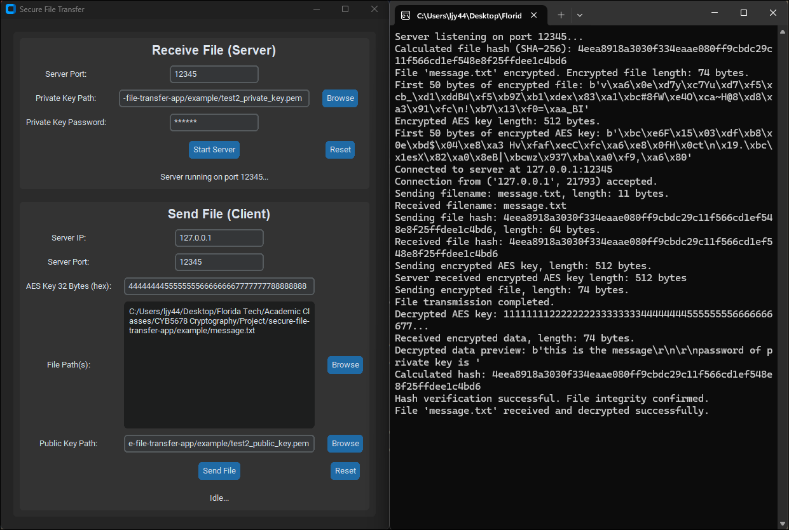

# Secure File Transfer App

## Project Description

This project is a **Secure File Transfer Application** that leverages **AES** (Advanced Encryption Standard) and **RSA** (Rivest-Shamir-Adleman) encryption techniques to ensure secure, confidential, and tamper-proof file transfers between two systems. The application features a user-friendly GUI for ease of use, allowing users to send and receive files securely.

---

## Features

- **Symmetric Encryption (AES)**: Encrypts file contents before transmission for confidentiality.
- **Asymmetric Encryption (RSA)**: Securely encrypts the AES key using RSA public keys.
- **File Transfer Protocol**: Uses a client-server model with TCP sockets for reliable file transfer.
- **Integrity Check**: Ensures data integrity using secure hashing algorithms (e.g., SHA-256).
- **Cross-Device Communication**: Works across local and public networks (requires proper configuration).
- **Graphical User Interface (GUI)**: Simplifies the user experience with distinct sections for sending and receiving files.

---

## Requirements

- **Python Version**: Python 3.7 or higher
- **Required Libraries**: 
  - `cryptography`
  - `customtkinter`
  - `pyinstall`

---

## Installation and Setup

### 1. Clone the Repository
To download the application, run one of the following commands:

  ```bash
  git clone https://github.com/ljy4499/secure-file-transfer-app.git
  cd ~/secure-file-transfer-app
  ```

### 2. Install Dependencies
  ```bash
  pip install -r requirements.txt
  ```

### 3. Build Application
  ```bash
  pyinstaller --onefile SecureFileTransfer_gui.py
  ```

### 4. Run Application
  ```bash
  cd dist
  .\SecureFileTransfer_gui.exe
  ```
or run the 'SecureFileTransfer_gui.exe' in 'dist' folder

---



## Test Application

### 1. Run Server

- Server Port: 12345(default, change if necessary)
- Private Key Path: Click 'Browse' -> (previous directory) -> 'example' folder -> select 'juyoul_private_key.pem'
- Private Key Password: juyoul
- Click 'Start Server'

### 2. Run Client

- Server IP: 127.0.0.1(default, loopback address for test, change if necessary)
- Server Port: 12345
- AES Key 32 Bytes (Hex): 1111111122222222333333334444444455555555666666667777777788888888
- File Path: Click 'Browse' -> (previous directory) -> 'example' folder -> select 'message.txt'
- Public Key Path: Click 'Browse' -> (previous directory) -> 'example' folder -> select 'juyoul_public_key.pem'
- Click 'Send File'

### 3. Remarks

- Downloaded file will be stored in /dist/download/(file_name.extension)
- Using this app with the public ip address may require 'port forwarding' from the router configuration
- Creating public/private key using OpenSSL
  
  ```bash
  openssl genpkey -aes-256-cbc -algorithm RSA -out your_private_key.pem -pkeyopt rsa_keygen_bits:4096
  openssl rsa -in test2_private_key.pem -pubout -out your_public_key.pem
  ```
